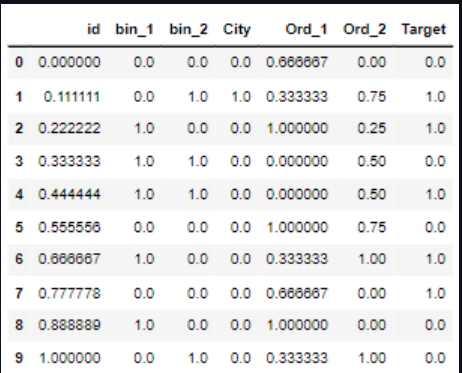
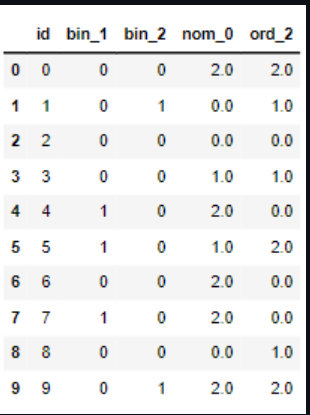

# EX-05-Feature-Generation

## AIM
To read the given data and perform Feature Generation process and save the data to a file. 

# Explanation
Feature Generation (also known as feature construction, feature extraction or feature engineering) is the process of transforming features into new features that better relate to the target.
 

# ALGORITHM
### STEP 1
Read the given Data
### STEP 2
Clean the Data Set using Data Cleaning Process
### STEP 3
Apply Feature Generation techniques to all the feature of the data set
### STEP 4
Save the data to the file

# CODE:
Program done by: M. Harikrishna.

Ref. No: 212221230059.
# Data.csv:
~~~~
import pandas as pd
df=pd.read_csv("Data.csv")
df
from category_encoders import BinaryEncoder
be=BinaryEncoder()
newdata1=be.fit_transform(df[["bin_1"]])
df["bin_1"]=newdata1
df
df1=df.copy()
from sklearn.preprocessing import OneHotEncoder
ohe=OneHotEncoder(sparse=False)
df1["City"]=ohe.fit_transform(df1[["City"]])
df1
from sklearn.preprocessing import LabelEncoder,OrdinalEncoder
temp1=["Hot","Warm","Very Hot","Cold"]
oe=OrdinalEncoder(categories=[temp1])
df1["Ord_1"]=oe.fit_transform(df1[["Ord_1"]])
df1
from sklearn.preprocessing import LabelEncoder,OrdinalEncoder
temp2=["Bachelors","Diploma","High School","Masters","PhD"]
oe2=OrdinalEncoder(categories=[temp2])
df1["Ord_2"]=oe2.fit_transform(df1[["Ord_2"]])
df1
from sklearn.preprocessing import MinMaxScaler
mms=MinMaxScaler()
df2=pd.DataFrame(mms.fit_transform(df1),columns=["id","bin_1","bin_2","City","Ord_1","Ord_2","Target"])
df2
from sklearn.preprocessing import StandardScaler
ss=StandardScaler()
df3=pd.DataFrame(ss.fit_transform(df1),columns=["id","bin_1","bin_2","City","Ord_1","Ord_2","Target"])
df3
from sklearn.preprocessing import MaxAbsScaler
mas=MaxAbsScaler()
df4=pd.DataFrame(mas.fit_transform(df1),columns=["id","bin_1","bin_2","City","Ord_1","Ord_2","Target"])
df4
from sklearn.preprocessing import RobustScaler
rs=RobustScaler()
df5=pd.DataFrame(rs.fit_transform(df1),columns=["id","bin_1","bin_2","City","Ord_1","Ord_2","Target"])
df5
~~~~
# Encoding data.csv:
~~~~
import pandas as pd
df=pd.read_csv("Encoding Data.csv")
df
from category_encoders import BinaryEncoder
be=BinaryEncoder()
newdata=be.fit_transform(df["bin_1"])
df["bin_1"]=newdata
df
be=BinaryEncoder()
newdata2=be.fit_transform(df[['bin_2']])
df["bin_2"]=newdata2
df
df1=df.copy()
from sklearn.preprocessing import LabelEncoder,OrdinalEncoder
le=LabelEncoder()
oe=OrdinalEncoder()
df1["nom_0"]=oe.fit_transform(df1[["nom_0"]])
df1
le=LabelEncoder()
oe=OrdinalEncoder()
temp=["Hot","Warm","Cold"]
enc=OrdinalEncoder(categories=[temp])
df1["ord_2"]=enc.fit_transform(df1[["ord_2"]])
df1
from sklearn.preprocessing import MinMaxScaler
sc=MinMaxScaler()
df2=pd.DataFrame(sc.fit_transform(df1),columns=['id','bin_1','bin_2','nom_0','ord_2'])
df2
from sklearn.preprocessing import StandardScaler
sc1=StandardScaler()
df3=pd.DataFrame(sc1.fit_transform(df1),columns=['id','bin_1','bin_2','nom_0','ord_2'])
df3
from sklearn.preprocessing import MaxAbsScaler
sc2=MaxAbsScaler()
df4=pd.DataFrame(sc2.fit_transform(df1),columns=['id','bin_1','bin_2','nom_0','ord_2'])
df4
from sklearn.preprocessing import RobustScaler
sc3=RobustScaler()
df5=pd.DataFrame(sc3.fit_transform(df1),columns=['id','bin_1','bin_2','nom_0','ord_2'])
df5
~~~~
# titanic data.csv:
~~~~
import pandas as pd
df=pd.read_csv("titanic_dataset.csv")
df
df1=df.copy()
df1.drop("Name",axis=1,inplace=True)
df1.drop("Ticket",axis=1,inplace=True)
df1.drop("Cabin",axis=1,inplace=True)
df1
df1.isnull().sum()
df1["Age"]=df["Age"].fillna(df["Age"].median())
df1["Embarked"]=df["Embarked"].fillna(df1["Embarked"].mode()[0])
df1.isnull().sum()
from category_encoders import BinaryEncoder
be=BinaryEncoder()
newdata=be.fit_transform(df1[["Sex"]])
df1["Sex"]=newdata
df1
from sklearn.preprocessing import LabelEncoder,OrdinalEncoder
temp=["C","Q","S"]
oe=OrdinalEncoder(categories=[temp])
df1["Embarked"]=oe.fit_transform(df1[["Embarked"]])
df1
from sklearn.preprocessing import MinMaxScaler
mms=MinMaxScaler()
df2=pd.DataFrame(mms.fit_transform(df1),columns=["PassengerId","Survived","Pclass","Sex","Age","SibSp","Parch","Fare","Embarked"])
df2
from sklearn.preprocessing import StandardScaler
ss=StandardScaler()
df3=pd.DataFrame(ss.fit_transform(df1),columns=["PassengerId","Survived","Pclass","Sex","Age","SibSp","Parch","Fare","Embarked"])
df3
from sklearn.preprocessing import MaxAbsScaler
mas=MaxAbsScaler()
df4=pd.DataFrame(mas.fit_transform(df1),columns=["PassengerId","Survived","Pclass","Sex","Age","SibSp","Parch","Fare","Embarked"])
df4
from sklearn.preprocessing import RobustScaler
rs=RobustScaler()
df5=pd.DataFrame(rs.fit_transform(df1),columns=["PassengerId","Survived","Pclass","Sex","Age","SibSp","Parch","Fare","Embarked"])
df5
~~~~
# OUPUT:

# Result:
Thus feature generation is generated successfully with the help of jupyter notebook and python programming.

